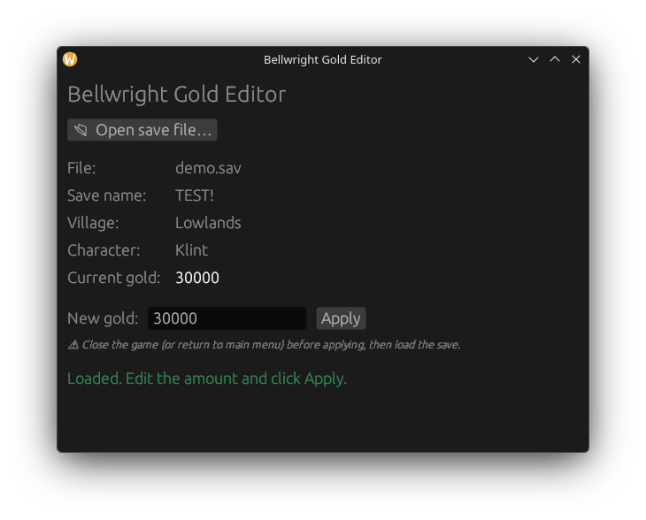

# Bellwright Gold Editor

[](https://github.com/BradMoeller/bellwright-gold-editor/actions/workflows/ci.yml)
[](LICENSE)
[](https://www.rust-lang.org/)

A small, safe, cross-platform (Windows / macOS / Linux) tool to view and edit
your **player gold** in [Bellwright](https://store.steampowered.com/app/1812450/Bellwright/)
save files. GUI and CLI included.



- 📂 Point it at a `Klint_*.sav` file (or drag-and-drop).
- 👀 See the save name, village, character, and **current gold**.
- ✏️ Type a new amount and click **Apply** — a one-time `<file>.bak` backup is made first.

No offsets, no hex editing. Gold is located automatically by structure, and every
write is re-parsed and verified before the file is replaced.

> ⚠️ **Single-player convenience tool.** Editing saves is at your own risk —
> always keep the `.bak` it creates. Close the game (or return to the main menu)
> before applying, then load the save.

## Install

### Prebuilt binaries
Grab the latest build for your OS from the
[**Releases**](https://github.com/BradMoeller/bellwright-gold-editor/releases) page.

### Build from source
Requires the [Rust toolchain](https://rustup.rs).

```bash
git clone https://github.com/BradMoeller/bellwright-gold-editor
cd bellwright-gold-editor
cargo run --release          # build + launch the GUI
```

You can also launch with a save preselected (handy for OS file associations or
drag-onto-exe): `bellwright-gold-editor path/to/Klint_1.sav`.

On **Linux**, the GUI needs a few system dev libraries (Windows/macOS need none):

```bash
# Debian/Ubuntu
sudo apt install libgtk-3-dev libxcb-render0-dev libxcb-shape0-dev \
                 libxcb-xfixes0-dev libxkbcommon-dev libssl-dev
# Fedora: gtk3-devel    •    Arch: gtk3
```

## Where are my saves?

| OS | Path |
|----|------|
| Windows | `%LOCALAPPDATA%\Bellwright\Saved\SaveGames\<steamid>\Klint_<slot>.sav` |
| Linux (Proton) | `…/steamapps/compatdata/1812450/pfx/drive_c/users/steamuser/AppData/Local/Bellwright/Saved/SaveGames/<steamid>/` |

The in-game save name (e.g. "TEST!") is stored *inside* the file, not the filename —
the app shows it so you can pick the right one.

## Command-line use

A headless `bellwright-gold-cli` binary ships alongside the GUI:

```bash
bellwright-gold-cli info <save.sav>          # show name, village, current gold
bellwright-gold-cli set  <save.sav> <amount> # set gold (creates <save>.bak once)
```

Build just the CLI (no GUI libraries):

```bash
cargo build --release --no-default-features --bin bellwright-gold-cli
```

## How it works

Bellwright saves are a UE `FArchive::SerializeCompressed` container (magic `VSWB`)
wrapping an Oodle-Kraken-compressed custom protobuf blob. Player gold is protobuf
field 6 inside a uniquely shaped record, located via the globally-unique byte
signature `2a 04 ?? ?? ?? ?? 30 <varint> 3a`.

On save, the tool rewrites only the affected chunk(s) as uncompressed Oodle blocks,
fixes the enclosing protobuf length-prefixes when the value's byte-width changes,
and updates the container size and `Summary.CompressedSize` fields. Decompression
uses the pure-Rust [`oozextract`](https://crates.io/crates/oozextract) crate, so
there is **no** dependency on a native Oodle DLL.

Full reverse-engineered format notes: [`docs/save_format.md`](docs/save_format.md).

## Project layout

```
src/lib.rs        core: parse, decompress, locate gold, patch (no GUI deps, unit-tested)
src/main.rs       egui/eframe desktop GUI
src/bin/cli.rs    headless CLI
docs/             format spec + screenshot
```

## Contributing

Issues and PRs welcome. Please run `cargo fmt`, `cargo clippy`, and `cargo test`
before submitting. This is an unofficial, fan-made tool and is not affiliated with
or endorsed by the developers of Bellwright.

## License

[MIT](LICENSE) © Brad Moeller
